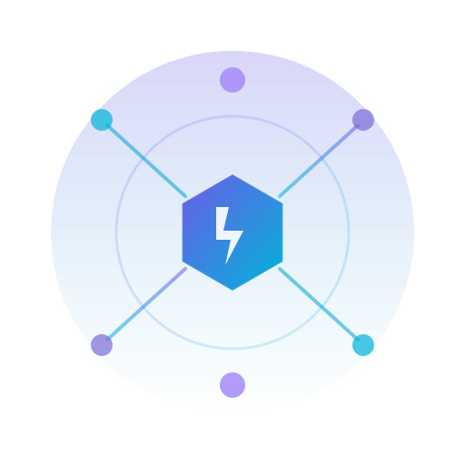

<p align="center">
  
</p>

# Nexus

A modular AI agent harness built on a pure event-driven architecture in Go. The core manages only the event lifecycle and plugin registry — all behavior (LLM interaction, tool execution, output rendering, etc.) is delivered through composable plugins.

Nexus can run two ways:

- **CLI** — `cmd/nexus` binary with terminal UI, browser UI, or oneshot mode
- **Desktop app** — Embed one or more agents in a Wails desktop shell using `pkg/desktop/`

## Prerequisites

- Go 1.23+
- An API key for your LLM provider ([Anthropic](https://console.anthropic.com/), [OpenAI](https://platform.openai.com/), etc.)
- [Wails v2 CLI](https://wails.io/docs/gettingstarted/installation) (desktop apps only)

## Quick Start: CLI

```bash
# Set your API key (provider-specific)
export ANTHROPIC_API_KEY="your-key-here"   # for Anthropic
# export OPENAI_API_KEY="your-key-here"    # for OpenAI

# Build and run with default config
make run

# Or run a specific profile
bin/nexus -config configs/coding.yaml
```

The API key can also be set in a `.env` file in the project root.

## Quick Start: Desktop App

The reference desktop app lives at `cmd/desktop/`. It hosts two example agents (hello-world and staffing-match) in a single Wails window.

```bash
cd cmd/desktop

# Development mode (live reload)
wails dev

# Production build
wails build
```

The API key is entered through the in-app settings page (stored in OS keychain).

To build your own desktop app, see the [Desktop Shell documentation](docs/src/desktop/building-your-app.md).

## Configuration Profiles

| Profile | Shell Access | Agent | Use Case |
|---------|-------------|-------|----------|
| `default.yaml` | Limited | ReAct | General purpose |
| `coding.yaml` | Extended (make, docker, npm, cargo, python) | ReAct | Software development |
| `research.yaml` | None | ReAct | Research and analysis |
| `planned.yaml` | Limited | ReAct + Dynamic planner | Auto-approved planning |
| `planned-static.yaml` | Limited | ReAct + Static planner | Fixed workflow steps |
| `browser.yaml` | Limited | ReAct | Browser UI instead of TUI |
| `planexec.yaml` | Limited | Plan & Execute | Multi-step task execution |
| `orchestrator.yaml` | Limited | Orchestrator | Multi-agent coordination |

Configuration is YAML-based. Each profile declares which plugins to load and their settings. See `configs/default.yaml` for the full schema.

## Architecture

Plugins never call each other directly — all communication flows through a central typed event bus.

```
┌─────────────┐     ┌───────────┐     ┌──────────────┐
│   TUI / IO  │◄───►│           │◄───►│  LLM Provider│
└─────────────┘     │           │     └──────────────┘
                    │  Event    │
┌─────────────┐     │   Bus     │     ┌──────────────┐
│    Tools    │◄───►│           │◄───►│    Agents    │
└─────────────┘     │           │     └──────────────┘
                    │           │
┌─────────────┐     │           │     ┌──────────────┐
│   Memory    │◄───►│           │◄───►│  Gates       │
└─────────────┘     └───────────┘     └──────────────┘
```

### Using Nexus as a library

Nexus embeds in any Go process without owning signals or process lifecycle:

```go
eng, _ := engine.NewFromBytes(configYAML)
eng.Registry.Register("nexus.io.wails", wailsio.New)
eng.Registry.Register("my.custom.plugin", myplugin.New)
eng.Boot(ctx)       // non-blocking
<-eng.SessionEnded()
eng.Stop(ctx)
```

**CLI** uses `eng.Run(ctx)` which wraps Boot + signal handling + Stop. **Embedders** must call `Boot`/`Stop` directly — `Run` installs its own SIGINT/SIGTERM handler, which conflicts with host processes.

### Plugin categories

| Category | Plugins | Description |
|----------|---------|-------------|
| **Agents** | `react`, `planexec`, `subagent`, `orchestrator` | Agent loops and coordination |
| **Providers** | `anthropic`, `openai` | LLM API providers |
| **Tools** | `shell`, `fileio`, `pdf`, `opener`, `ask` | Capabilities agents can invoke |
| **I/O** | `tui`, `browser`, `oneshot`, `wails` | User-facing transports |
| **Memory** | `conversation`, `compaction` | Context persistence and management |
| **Observers** | `logger`, `thinking` | Structured logging and thinking persistence |
| **Planners** | `dynamic`, `static` | Optional planning phase before agent execution |
| **Gates** | `endless_loop`, `stop_words`, `token_budget`, `rate_limiter`, `prompt_injection`, `json_schema`, `output_length`, `content_safety`, `context_window` | Quality, safety, and operational guards |
| **Skills** | `skills` | Skill discovery from `./skills/` and `~/.agents/skills/` |
| **System** | `dynvars`, `cancel` | Dynamic variables, cancellation |

## Project Structure

```
cmd/
  nexus/                CLI entry point
  desktop/              Reference Wails desktop app (multi-agent)
pkg/
  engine/               Core: event bus, plugin lifecycle, sessions, config
  events/               Typed event definitions
  ui/                   UI adapter contract (shared by browser + wails transports)
  desktop/              Desktop shell framework (embeddable)
plugins/
  agents/               Agent loops (react, planexec, subagent, orchestrator)
  providers/anthropic/  Anthropic LLM provider (direct HTTP, no SDK)
  providers/openai/     OpenAI LLM provider (direct HTTP, no SDK)
  tools/                Shell, file I/O, PDF, file opener, ask user
  io/                   TUI, browser, oneshot, wails transports
  memory/               Conversation history, context compaction
  observe/              Event logger, thinking persistence
  planners/             Dynamic and static planners
  gates/                Quality/safety/operational gates
  skills/               Skill discovery and catalog
  apps/helloworld/      Built-in hello-world example agent
configs/                YAML configuration profiles
prompts/                System prompts for agent personas
skills/                 Skill definitions (SKILL.md files)
docs/                   Full documentation (mdBook)
```

## Development

```bash
make build        # Build binary to bin/nexus
make run          # Build and run with default config
make test         # Run all tests
make fmt          # Format code
make vet          # Run go vet
make lint         # Run staticcheck (includes vet)
make clean        # Remove build artifacts
```

## Documentation

Full documentation is in `docs/` (mdBook format). Building the docs locally requires [mdBook](https://rust-lang.github.io/mdBook/guide/installation.html) installed on your machine:

```bash
# Install mdBook (requires Rust/Cargo)
cargo install mdbook

# Or via homebrew
brew install mdbook

# Build and serve docs locally
cd docs && mdbook serve
```

Topics covered:

- [Architecture](docs/src/architecture/overview.md) — Event bus, plugin system, sessions
- [Plugin Reference](docs/src/plugins/overview.md) — Every plugin's config, events, and behavior
- [Desktop Shell](docs/src/desktop/overview.md) — Building desktop apps with `pkg/desktop/`
- [Guides](docs/src/skills/authoring.md) — Writing skills, creating custom plugins
- [Configuration Reference](docs/src/configuration/reference.md) — Full config schema
