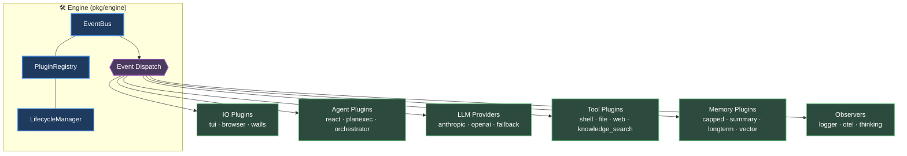
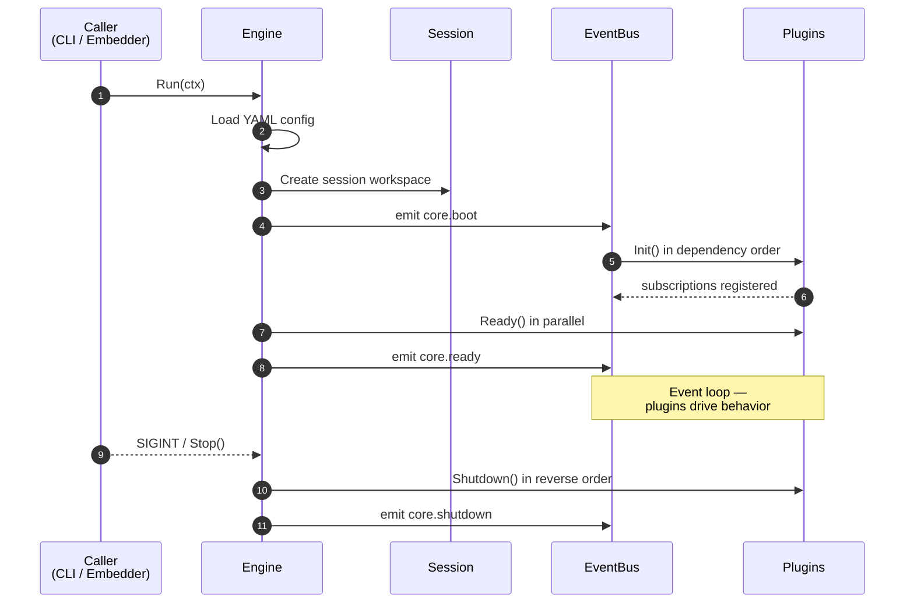
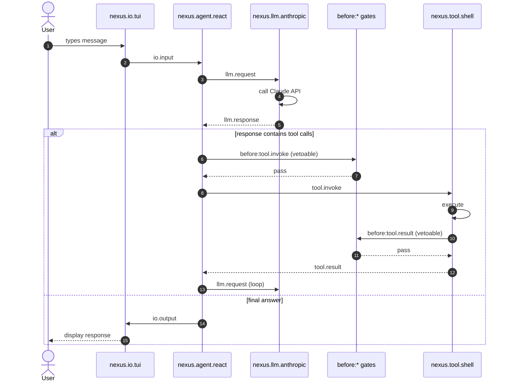

# Architecture Overview

Nexus follows a strict event-driven architecture. The engine is intentionally minimal — it provides the event bus, plugin registry, lifecycle management, and session workspace. **All behavior comes from plugins.**

## Core Principle

Plugins never call each other directly. Every interaction flows through the central event bus as typed events. This keeps plugins decoupled and makes the system easy to extend or reconfigure.

## Engine Components

The engine (`pkg/engine/`) contains these components:

| Component | File | Purpose |
|-----------|------|---------|
| **Engine** | `engine.go` | Top-level orchestrator that wires everything together |
| **EventBus** | `bus.go` | Central event dispatch with priority ordering and filtering |
| **PluginRegistry** | `registry.go` | Stores plugin factories, creates instances on demand |
| **LifecycleManager** | `lifecycle.go` | Boots plugins in dependency order, shuts down in reverse |
| **SessionWorkspace** | `session.go` | File-based session persistence |
| **ModelRegistry** | `models.go` | Resolves model role names to provider/model/token configs |
| **PromptRegistry** | `prompt.go` | Dynamic system prompt assembly from plugin sections |
| **ContextManager** | `context.go` | Agent context management (placeholder for future windowing) |
| **SystemInfo** | `system.go` | Platform detection (OS, architecture, open commands) |
| **Config** | `config.go` | YAML configuration loading and merging |

## Boot Sequence

When `Engine.Run()` is called:

1. **Config loaded** — YAML file is parsed, defaults merged, per-plugin configs extracted
2. **Session created** — A new session workspace is set up on disk (or an existing one is resumed)
3. **`core.boot` emitted** — Signals the start of the boot process
4. **Plugins initialized** — Topologically sorted by dependencies, then `Init()` called serially
5. **Plugins readied** — `Ready()` called in parallel on all initialized plugins
6. **`core.ready` emitted** — All plugins are up and listening
7. **Event loop** — The engine listens for events until a shutdown signal arrives
8. **Shutdown** — Plugins shut down in reverse dependency order, `core.shutdown` emitted

## Event Flow Example

Here's a typical request flow through the system:

## Key Design Decisions

### Synchronous Dispatch
Events are dispatched synchronously — handlers execute one at a time, ordered by priority. This makes the system predictable and avoids race conditions.

### Vetoable Events
Events prefixed with `before:` are vetoable. Any handler can block the action by setting a veto on the payload. This enables approval workflows (e.g., confirming tool execution).

### Plugin Dependencies
Plugins declare their dependencies by ID. The lifecycle manager topologically sorts them to ensure correct init order. Circular dependencies cause a boot failure.

### Multi-Instance Plugins
Some plugins (like `nexus.agent.subagent`) support multiple instances via ID suffixes. For example, `nexus.agent.subagent/researcher` creates an instance with `InstanceID` set to the full suffixed ID.

## Next Steps

- [Event Bus](./event-bus.md) — How events are dispatched, filtered, and prioritized
- [Plugin System](./plugin-system.md) — The plugin interface, lifecycle, and how to write your own
- [Sessions](./sessions.md) — How session data is persisted to disk
