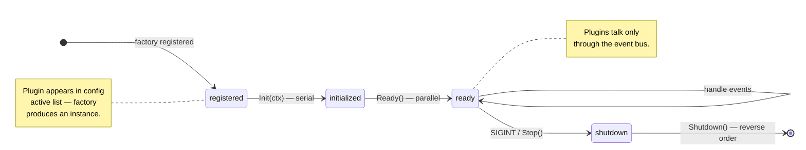

# Plugin System

Every piece of behavior in Nexus is delivered through plugins. The engine itself only manages the event bus, plugin lifecycle, and session workspace.

## Plugin Interface

All plugins implement the `engine.Plugin` interface:

```go
type Plugin interface {
    ID() string                              // Unique identifier (e.g., "nexus.tool.shell")
    Name() string                            // Human-readable name
    Version() string                         // Version string
    Dependencies() []string                  // IDs that must ALREADY be active (orders boot)
    Requires() []Requirement                 // IDs to auto-activate if absent (see below)
    Init(ctx PluginContext) error             // Initialize with engine services
    Ready() error                            // Called after all plugins initialized
    Shutdown(ctx context.Context) error       // Graceful teardown
    Subscriptions() []EventSubscription      // Events this plugin listens to
    Emissions() []string                     // Event types this plugin may emit
}
```

### `Dependencies()` vs `Requires()`

Two related but distinct methods:

- **`Dependencies()`** only *validates* that the listed IDs are already active and *orders* boot (topological sort). If an ID in the list is missing, boot fails. It never activates anything.
- **`Requires()`** *activates* missing siblings with default config. At boot, the lifecycle walks `Requires()` transitively from the user-declared active list and appends any missing IDs before the topological sort runs.

Return `Requires() []Requirement { return nil }` when a plugin has no hard siblings.

### Auto-activation semantics

```go
type Requirement struct {
    ID       string            // plugin to auto-activate
    Default  map[string]any    // config used only when user has not configured ID
    Optional bool              // true → skip silently with WARN when factory is unregistered
}
```

**Merge rule: whole-object replace.** If the user supplies *any* config for the required ID, the user's config wins entirely and `Default` is discarded. There is no field-level merge. This keeps precedence predictable and avoids surprise overrides.

**Cycles.** A cycle in `Requires()` is detected the same way as a `Dependencies()` cycle — boot fails with a clear error.

**Visibility.** Every auto-activation emits an `INFO` log at boot:

```
auto-activating plugin nexus.memory.capped (required by nexus.agent.react); config_source=default
```

After expansion completes, a single `"active plugin set resolved"` line lists every entry annotated `[user]` (declared in config) or `[auto: required-by=X,config=default|user-override]`. Missing optional requirements log `WARN` and boot proceeds.

**Example: ReAct's `Requires()`.**

```go
func (p *Plugin) Requires() []engine.Requirement {
    return []engine.Requirement{
        {
            ID: "nexus.memory.capped",
            Default: map[string]any{"max_messages": 100, "persist": true},
        },
        {ID: "nexus.control.cancel"},
        {ID: "nexus.tool.catalog"},
    }
}
```

When a user's config lists only `nexus.agent.react` in `plugins.active`, the engine automatically brings in the conversation, cancel, and catalog plugins at boot. Users can still override any of them by listing the ID in `plugins.active` with their own config map.

## Plugin Context

During initialization, each plugin receives a `PluginContext` with access to engine services:

```go
type PluginContext struct {
    Config     map[string]any     // This plugin's config from YAML
    Bus        EventBus           // The central event bus
    Logger     *slog.Logger       // Structured logger scoped to this plugin
    DataDir    string             // Session-scoped directory for this plugin's data
    Session    *SessionWorkspace  // The active session workspace
    Models     *ModelRegistry     // Resolve model roles to concrete configs
    Prompts    *PromptRegistry    // Register dynamic system prompt sections
    System     *SystemInfo        // Platform info (OS, arch, open command)
    InstanceID string             // Full ID including suffix for multi-instance plugins
}
```

## Plugin ID Convention

Plugin IDs use a dotted namespace: `nexus.<category>.<name>`

| Category | Examples |
|----------|----------|
| `agent` | `nexus.agent.react`, `nexus.agent.planexec` |
| `llm` | `nexus.llm.anthropic` |
| `tool` | `nexus.tool.shell`, `nexus.tool.file` |
| `memory` | `nexus.memory.capped`, `nexus.memory.compaction` |
| `io` | `nexus.io.tui`, `nexus.io.browser` |
| `observe` | `nexus.observe.thinking`, `nexus.observe.otel` |
| `planner` | `nexus.planner.dynamic`, `nexus.planner.static` |
| `skills` | `nexus.skills` |
| `system` | `nexus.system.dynvars` |
| `control` | `nexus.control.cancel` |

## Plugin Registration

Plugins are registered as factories in `main.go`:

```go
eng.Registry.Register("nexus.tool.shell", shell.New)
eng.Registry.Register("nexus.tool.file", fileio.New)
```

The factory function signature is:

```go
func New() engine.Plugin
```

Registration makes the plugin available — it won't be instantiated unless it appears in the config's `active` list.

## Lifecycle



### Boot Phase

1. The lifecycle manager reads the `active` list from config
2. Plugins are topologically sorted by their declared `Dependencies()`
3. `Init()` is called serially in dependency order — each plugin receives its `PluginContext`
4. `Ready()` is called on all plugins (can run in parallel)

### Runtime

During runtime, plugins interact exclusively through the event bus. They emit events and handle events they've subscribed to.

### Shutdown Phase

1. A shutdown signal arrives (SIGINT, SIGTERM, or programmatic)
2. `Shutdown()` is called on each plugin in **reverse** dependency order
3. The event bus drains remaining in-flight events

## Dependencies

Plugins declare dependencies on other plugin IDs:

```go
func (p *MyPlugin) Dependencies() []string {
    return []string{"nexus.llm.anthropic", "nexus.agent.react"}
}
```

The lifecycle manager ensures dependencies are initialized before dependents. Circular dependencies cause a boot-time error.

### Instance-Aware Dependencies

For multi-instance plugins (e.g., `nexus.agent.subagent/researcher`), the dependency resolver first tries an exact match, then falls back to the base ID (without the suffix).

## Multi-Instance Plugins

Some plugins support running multiple instances. In the config, use a slash suffix:

```yaml
plugins:
  active:
    - nexus.agent.subagent/researcher
    - nexus.agent.subagent/writer

  nexus.agent.subagent/researcher:
    system_prompt: "You are a research specialist."
    tool_name: spawn_researcher

  nexus.agent.subagent/writer:
    system_prompt: "You are a writing specialist."
    tool_name: spawn_writer
```

Each instance receives its full ID (including suffix) in `PluginContext.InstanceID`. The instance should use this as its identity rather than the hardcoded base ID.

## Subscriptions and Emissions

Plugins declare what they listen to and what they emit. This serves as documentation and enables future validation:

```go
func (p *MyPlugin) Subscriptions() []engine.EventSubscription {
    return []engine.EventSubscription{
        {EventType: "io.input", Priority: 50},
        {EventType: "tool.result", Priority: 50},
    }
}

func (p *MyPlugin) Emissions() []string {
    return []string{"io.output", "llm.request"}
}
```

Subscriptions declared here are automatically registered by the lifecycle manager. Plugins can also subscribe dynamically in `Init()` or `Ready()`.

## Plugin Data Directory

Each plugin gets a session-scoped directory for persisting data:

```go
func (p *MyPlugin) Init(ctx engine.PluginContext) error {
    // ctx.DataDir points to: ~/.nexus/sessions/<id>/plugins/<plugin-id>/
    // Write plugin-specific data here
    return nil
}
```

This directory is created lazily when accessed via `Session.PluginDir(pluginID)`.
