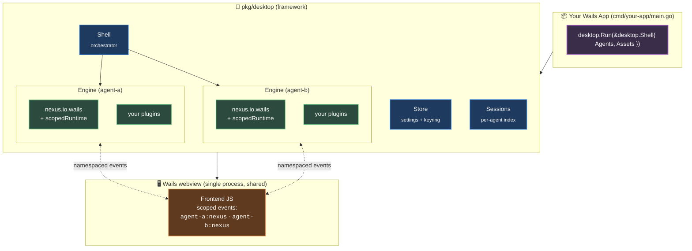

# Desktop Shell

The desktop shell framework (`pkg/desktop/`) provides everything needed
to embed one or more Nexus agents inside a Wails desktop application.
Your application supplies agent definitions, config YAML, and a
frontend — the framework handles engine lifecycle, event bridging,
settings persistence, session management, and OS integration.

The framework lives inside the Nexus repository. Desktop applications
that use it are built as separate Go modules that import
`github.com/frankbardon/nexus/pkg/desktop`. A reference implementation
ships at `cmd/desktop/` to demonstrate the full feature set.

## Architecture

### Key concepts

**One engine per agent.** Each agent gets its own `engine.Engine`
instance with its own bus, plugin set, session workspace, and config.
Agents never share an engine or bus — isolation is structural.

**Lazy boot.** Engines are created on demand when the frontend selects
an agent (`EnsureAgentRunning`). No engine runs until the user
navigates to it.

**Scoped runtimes.** Each agent's `nexus.io.wails` plugin receives a
`scopedRuntime` that namespaces Wails event channels by agent ID.
The plugin itself is unaware of multi-agent — it talks to its
`Runtime` interface, and the scoped wrapper handles the namespace.
This means outbound events go to `"{agentID}:nexus"` and inbound
events come from `"{agentID}:nexus.input"`.

**Config-driven event bridging.** Domain events flow through the bus,
not through Wails-bound Go methods. The `nexus.io.wails` plugin
config declares exactly which events cross the bus-to-frontend
boundary via `subscribe` (outbound) and `accept` (inbound) lists.

**No `eng.Run()`.** Desktop apps must use `Boot`/`Stop` directly.
`Run` installs its own `SIGINT`/`SIGTERM` handler, which conflicts
with Wails owning the process lifecycle.

## Components

| File | Role |
|------|------|
| `shell.go` | Core orchestrator. Manages per-agent engine lifecycles, Wails app setup, all Wails-bound methods. |
| `settings.go` | Settings schema types (`SettingsField`, `FieldType`, `SettingsSchema`). |
| `store.go` | Persistent settings store. Plaintext JSON at `~/.nexus/desktop/settings.json`, secrets in OS keychain via `go-keyring`. |
| `resolve.go` | `${var}` placeholder resolution in config YAML from settings store with scope fallback (agent then shell). |
| `sessions.go` | Session metadata index (`SessionMeta`). Persists to `~/.nexus/desktop/sessions.json`. Cleanup and reconciliation on startup. |
| `runtime.go` | Scoped `Runtime` adapter for multi-agent event isolation. Enriches file dialog `DefaultDirectory` from settings. |
| `watcher.go` | Filesystem watcher (`fsnotify`) for file browser panel. Watches one directory at a time with debounced change notifications. |

## Lifecycle

1. **`desktop.Run(shell)`** — Configures and starts the Wails app.
   Blocks until the app exits.
2. **`onStartup`** — Initializes the settings store, session index,
   file watcher, and agent state entries. Runs session maintenance
   (cleanup expired, reconcile orphans).
3. **Frontend selects agent** — Calls `EnsureAgentRunning(agentID)`.
4. **`bootAgent`** — Resolves `${var}` placeholders in the agent's
   config YAML, creates the engine via `engine.NewFromBytes`, registers
   plugin factories, installs the scoped runtime on the wails plugin,
   calls `eng.Boot(ctx)`, installs bus subscriptions for session
   metadata and UI state, creates the session index entry.
5. **Agent runs** — Domain events flow between plugins and frontend
   through the bus bridge.
6. **New session / recall** — `StopAgent` tears down the current
   engine (unsubs, `eng.Stop`, marks session completed), then
   `bootAgent` creates a fresh engine (or one with `RecallSessionID`
   set for history replay).
7. **`onShutdown`** — Stops all running engines, closes the file
   watcher.

## What the framework does NOT do

- **Own your frontend.** The framework ships a minimal base template
  in `frontend/dist/`, but you embed your own `assets` via
  `Shell.Assets`. Your frontend is yours — Alpine.js, React, vanilla
  JS, whatever fits.
- **Define your domain plugins.** All agent behavior comes from
  plugins you register in `Agent.Factories`. The framework only
  manages the `nexus.io.wails` plugin lifecycle.
- **Restrict agent count.** One agent, five agents — the framework
  scales. Each gets its own engine and scoped runtime.
