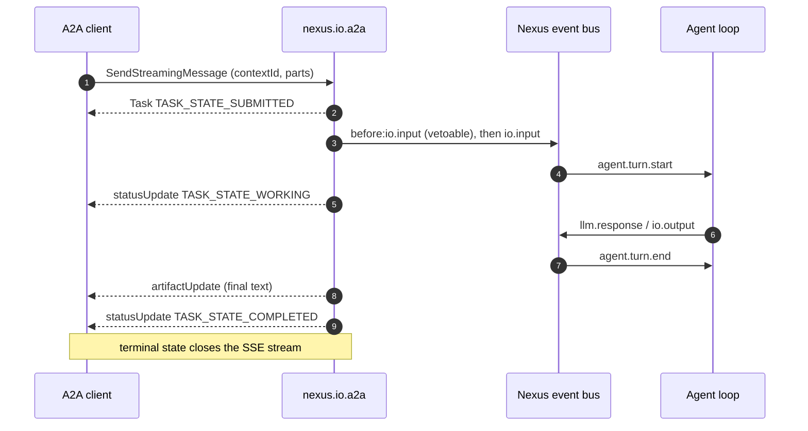

# Agent2Agent (A2A) Interoperability

[A2A](https://a2aproject.github.io/A2A/) is an open protocol for agent-to-agent
communication. It is built around three objects: a **Task** (one unit of work,
moving through a lifecycle), a **Message** (composed of **Parts**), and an
**Artifact** (task output). An agent publishes an **Agent Card** at a well-known
URL so a client can discover what it does and how to authenticate to it.

Nexus speaks A2A through two pieces:

| Piece | What it is |
|---|---|
| `pkg/a2a` | A hand-rolled, dependency-free A2A codec: the data model, both HTTP bindings, the SSE transport, the Agent Card types, and the protocol error model. No third-party A2A SDK. |
| [`nexus.io.a2a`](../plugins/io/a2a.md) | The **serve** transport: one HTTP listener that exposes a running Nexus instance as an A2A agent. |

This guide covers the mapping between the two protocols and how a client drives
a Nexus turn end to end. For every configuration key, its type and its default,
the [Configuration Reference](../configuration/reference.md#nexusioa2a) is
canonical.

## Targeted spec version: 1.0.x

Nexus targets **A2A specification 1.0.x** and nothing else. `pkg/a2a` exposes
this as constants:

```go
a2a.ProtocolVersion // "1.0" — the Major.Minor value on the wire
a2a.SpecVersion     // the spec revision + fetch date the codec was written against
```

**0.3.x is not supported.** 1.0 was a breaking revision, and two of its changes
mean a 0.3 client cannot be served by a 1.0 codec even accidentally:

- JSON-RPC method names are PascalCase operation names (`SendMessage`,
  `GetTask`), not the 0.3-era dotted forms (`message/send`, `tasks/get`).
- `Part` is flattened. There are no separate `TextPart` / `FilePart` /
  `DataPart` types; a `Part` is one object with a content oneof (`text`, `raw`,
  `url`, `data`) plus `mediaType`, `filename` and `metadata`.

An explicit `A2A-Version: 0.3` is refused with `VersionNotSupportedError`. An
**absent** `A2A-Version` is read as `1.0` by default rather than the literal
§3.6.2 fallback of `0.3` — see [A2A version
negotiation](../configuration/reference.md#a2a-version-negotiation) for the
reasoning and the `strict_version_header` opt-out.

## The mapping: `contextId` is a session, a Task is a turn

| A2A | Nexus |
|---|---|
| `contextId` | A **session** (`~/.nexus/sessions/<id>/`) — one conversation with one `memory.history` buffer. |
| `Task` | **One turn**: one `io.input`, the agent loop it drives, and the answer it produces. |
| Task lifecycle | `SUBMITTED` on accept → `WORKING` at `agent.turn.start` → `COMPLETED` at `agent.turn.end`, or `FAILED`. |
| `Message.parts` (text) | The turn's prompt, emitted as `before:io.input` (vetoable) then `io.input`. |
| `Artifact` with a text Part | The turn's final assistant text, taken from `io.output` so output gates have had their say. |
| Agent Card | Hand-authored config, with interfaces/capabilities/security derived from the live listener. |

A multi-turn conversation is therefore **N Tasks sharing one `contextId`**, not
one long-lived Task. That is the mapping to hold in mind when reading the rest
of this page: nothing accumulates inside a Task, because a Task is over the
moment the turn is.



## One process serves exactly one context

This is the constraint that shapes everything about the standalone serve
transport, so it is worth stating plainly rather than discovering from an error
message.

**A Nexus process owns exactly one session**, fixed at boot. It has one
`memory.history` buffer, one session workspace on disk, one set of plugin data
directories. There is no bus event that starts a second session inside a running
process, and no event that resets history — adding one would be a cross-cutting
change to every memory plugin, not a transport concern.

So `nexus.io.a2a` binds its process to one A2A context:

1. **The first call claims the session.** A client that names no `contextId` is
   assigned the Nexus session id and gets it back on the Task, so it has
   something stable to keep using. A client that names one has that name
   recorded.
2. **Later calls naming the same context continue it.** History is intact for
   free, because `memory.history` already persists across turns within a
   session.
3. **A different `contextId` is refused** with `UnsupportedOperationError`, and
   the refusal names the context the process is bound to.

Refusing is the deliberate choice. The alternative — accepting the new
`contextId` — would hand the caller a conversation already carrying another
context's history while calling it new. A client cannot detect that, and the
model would answer the second caller's question with the first caller's context
in its prompt. An error a client can read and route around is strictly better
than a confident wrong answer.

The refusal is machine-readable, carrying both a stable `detail` token and the
context that *is* served:

```json
{"error":{"code":400,"status":"FAILED_PRECONDITION",
  "message":"context \"other\" is not served by this agent: it is bound to context \"demo\" for the life of its Nexus session, so run one instance per context",
  "details":[{"@type":"type.googleapis.com/google.rpc.ErrorInfo",
    "domain":"a2a-protocol.org","reason":"UNSUPPORTED_OPERATION",
    "metadata":{"contextId":"demo","detail":"CONTEXT_NOT_SERVED"}}]}}
```

For the same reason, **one task runs at a time**. A second `SendMessage` while
one is in flight is refused with `UnsupportedOperationError`
(`detail: TASK_ALREADY_IN_FLIGHT`): the listener fronts one agent loop, and two
turns would interleave on the same bus and corrupt both conversations.

**Multi-context A2A is the session broker's job.** One process per context is
exactly the shape the [session broker](./session-broker.md) already automates —
it cold-spawns an OS-isolated `nexus` instance per caller and releases it when
idle. Fronting the broker with A2A, so that an unknown `contextId` spawns an
instance and a known one resumes it, is planned and does **not** work today.
Until it does, a deployment that must serve many concurrent contexts runs many
instances and routes to them itself.

## Worked example

`configs/test-a2a-serve.yaml` ships a complete, credentialed listener with
mocked LLM responses, so this runs with **no API key**.

```bash
make build
bin/nexus -config configs/test-a2a-serve.yaml
```

> That config drives the engine with `nexus.io.test`, whose `timeout: 20s` ends
> the session — and the process — twenty seconds after boot. Raise that value if
> you want a longer window to poke at the endpoint by hand.

It binds `127.0.0.1:18191` (the default for a real deployment is
`127.0.0.1:8091`) and guards operations with the bearer token
`test-a2a-token`.

### 1. Fetch the Agent Card

Discovery is unauthenticated by default — a client fetches the card precisely to
learn which credentials to obtain, so gating it behind those credentials would
be circular.

```bash
curl -s localhost:18191/.well-known/agent-card.json
```

```json
{
  "name": "nexus-test-agent",
  "description": "A Nexus harness exposed over A2A for interop testing.",
  "supportedInterfaces": [
    { "url": "http://127.0.0.1:18191/a2a",    "protocolBinding": "JSONRPC",   "protocolVersion": "1.0" },
    { "url": "http://127.0.0.1:18191/a2a/v1", "protocolBinding": "HTTP+JSON", "protocolVersion": "1.0" }
  ],
  "version": "0.1.0",
  "capabilities": { "streaming": true, "pushNotifications": false, "extendedAgentCard": false },
  "securitySchemes": {
    "static": { "httpAuthSecurityScheme": {
      "description": "Shared bearer token issued out-of-band by the operator of this agent.",
      "scheme": "Bearer" } }
  },
  "securityRequirements": [ { "schemes": { "static": {} } } ],
  "defaultInputModes": ["text/plain"],
  "defaultOutputModes": ["text/plain"],
  "skills": [ { "id": "chat", "name": "Conversational turn", "…": "…" } ]
}
```

Read three things off it. `supportedInterfaces` names both bindings and their
URLs. `capabilities` is derived from the operations the plugin actually
implements, so it never overstates. `securitySchemes` is derived from the
configured validator chain, so what you are told to present is what is enforced.

### 2. Send a message and stream the task

`SendStreamingMessage` over the JSON-RPC binding:

```bash
curl -sN localhost:18191/a2a \
  -H 'Authorization: Bearer test-a2a-token' \
  -H 'A2A-Version: 1.0' \
  -H 'Content-Type: application/a2a+json' \
  -d '{"jsonrpc":"2.0","id":1,"method":"SendStreamingMessage","params":
       {"message":{"messageId":"m1","role":"ROLE_USER",
        "parts":[{"text":"hello"}],"contextId":"demo"}}}'
```

The response is `text/event-stream`. Each record's `data:` payload is a full
JSON-RPC response envelope repeating the request id, whose `result` is one
`StreamResponse` (task ids shortened here for readability):

```
data: {"jsonrpc":"2.0","id":1,"result":{"task":{"id":"task-0e42cb…","contextId":"demo","status":{"state":"TASK_STATE_SUBMITTED","timestamp":"2026-08-18T16:05:23.766Z"}}}}

data: {"jsonrpc":"2.0","id":1,"result":{"statusUpdate":{"taskId":"task-0e42cb…","contextId":"demo","status":{"state":"TASK_STATE_WORKING","timestamp":"2026-08-18T16:05:23.767Z"}}}}

data: {"jsonrpc":"2.0","id":1,"result":{"artifactUpdate":{"taskId":"task-0e42cb…","contextId":"demo","artifact":{"artifactId":"task-0e42cb…-response","name":"response","parts":[{"text":"Hello from a mocked Nexus agent."}]},"lastChunk":true}}}

data: {"jsonrpc":"2.0","id":1,"result":{"statusUpdate":{"taskId":"task-0e42cb…","contextId":"demo","status":{"state":"TASK_STATE_COMPLETED","timestamp":"2026-08-18T16:05:23.768Z"}}}}
```

Four frames, in a fixed order:

1. The opening **Task** in `TASK_STATE_SUBMITTED`. A2A requires a stream to open
   with a Task or a Message, and no update event may name a task that does not
   exist yet.
2. A **status update** to `TASK_STATE_WORKING`, written when the agent turn
   starts.
3. An **artifact update** carrying the final assistant text as a text Part.
4. A **status update** to `TASK_STATE_COMPLETED`, which **closes the stream**.

The artifact must precede the terminal status, and does: A2A closes a stream the
moment a frame reports a terminal state, so an artifact queued after `COMPLETED`
would be dropped and the client would see a completed task with no output.
`TASK_STATE_FAILED`, `CANCELED` and `REJECTED` close the stream the same way, so
a client handles one shape of ending rather than two.

Over the **REST binding** the same stream is available at `POST
<rest_prefix>/message:stream`, and each `data:` payload is a bare
`StreamResponse` with no JSON-RPC envelope. `pkg/a2a`'s `SSEReader`
auto-detects the framing per record, so a client need not know which binding the
server chose before it starts reading.

### 3. Or block and take the finished Task

Blocking is A2A's default for `SendMessage` (§3.2.2): the call returns when the
work is done, not when it was accepted. Here over the REST binding:

```bash
curl -s -X POST localhost:18191/a2a/v1/message:send \
  -H 'Authorization: Bearer test-a2a-token' \
  -H 'A2A-Version: 1.0' \
  -H 'Content-Type: application/a2a+json' \
  -d '{"message":{"messageId":"m2","role":"ROLE_USER",
       "parts":[{"text":"and again"}],"contextId":"demo"}}'
```

```json
{"task":{"id":"task-b102f6…","contextId":"demo",
  "status":{"state":"TASK_STATE_COMPLETED","timestamp":"2026-08-18T16:05:50.629Z"},
  "artifacts":[{"artifactId":"task-b102f6…-response","name":"response",
    "parts":[{"text":"Still here on the second turn."}]}]}}
```

The blocking reply is folded from exactly the frames the streaming path writes,
so the two bindings cannot report different outcomes for the same turn. (The
answer differs from the first call's only because the test config scripts two
mock responses.)

Because this call reused `contextId: "demo"`, it ran in the **same session** as
the streaming call above, with the first exchange still in history. A different
`contextId` is refused — that is the payload shown [earlier](#one-process-serves-exactly-one-context).

`configuration.returnImmediately` answers with the task as it stands and lets
the client follow it with `GetTask` or `SubscribeToTask`. That works because a
run's lifetime is its **task's**, not its request's: the listener's single
active-task slot is released when the task reaches a terminal state, so a client
may also disconnect mid-turn and reattach later without failing its own task.
The cost of that is why `CancelTask` exists — a turn nobody is watching would
otherwise hold the process's only agent loop with nothing able to interrupt it.

A blocking `SendMessage` returns on a terminal state **or** on
`INPUT_REQUIRED`: a task waiting for the caller cannot be waited on by the
caller.

### 4. Reading tasks back

A task outlives the call that created it. Poll one:

```bash
curl -s localhost:18191/a2a/v1/tasks/<task-id> \
  -H 'Authorization: Bearer test-a2a-token' -H 'A2A-Version: 1.0' | jq
```

```json
{"id":"task-e0fc24…","contextId":"demo",
 "status":{"state":"TASK_STATE_COMPLETED","timestamp":"2026-08-18T18:20:10.828Z"},
 "artifacts":[{"artifactId":"task-e0fc24…-response","name":"response",
   "parts":[{"text":"Hello from a mocked Nexus agent."}]}],
 "history":[{"messageId":"m1","contextId":"demo","taskId":"task-e0fc24…",
   "role":"ROLE_USER","parts":[{"text":"Are you still there?"}]},
  {"messageId":"msg-de55c4…","contextId":"demo","taskId":"task-e0fc24…",
   "role":"ROLE_AGENT","parts":[{"text":"Hello from a mocked Nexus agent."}]}]}
```

`history` is the trail of message **references** the store retained, rendered as
text messages — not a replay of Nexus's conversation buffer. §3.7 leaves it to
the server which messages are persisted and warns clients not to assume all of
them are present, so a bounded reference trail is a conforming history.
`historyLength` caps it: `0` omits it, `N` keeps the most recent `N`.

List them, newest first. History is included unless you cap it, so
`historyLength=0` is the compact listing:

```bash
curl -s 'localhost:18191/a2a/v1/tasks?pageSize=1&historyLength=0' \
  -H 'Authorization: Bearer test-a2a-token' -H 'A2A-Version: 1.0' | jq
```

```json
{"tasks":[{"id":"task-e0fc24…","contextId":"demo",
   "status":{"state":"TASK_STATE_COMPLETED","timestamp":"2026-08-18T18:20:10.828Z"}}],
 "nextPageToken":"","pageSize":1,"totalSize":1}
```

Artifacts are the other way round — omitted unless `includeArtifacts=true`,
which is the specification's own default. The remaining filters are `contextId`,
`status` and `statusTimestampAfter`. `nextPageToken` is empty when the walk is
done and is a keyset cursor otherwise, so a task created while you page cannot
make the walk skip or repeat a row.

Re-attach a stream to a task, which replays its current state and then follows
it live:

```bash
curl -sN -X POST localhost:18191/a2a/v1/tasks/<task-id>:subscribe \
  -H 'Authorization: Bearer test-a2a-token' -H 'A2A-Version: 1.0'
```

```
data: {"task":{"id":"task-e0fc24…","contextId":"demo",
  "status":{"state":"TASK_STATE_COMPLETED","timestamp":"2026-08-18T18:20:10.828Z"},
  "artifacts":[…],"history":[…]}}
```

On a finished task that is one frame — the terminal snapshot — and the stream
closes. On a task still running it is the current snapshot followed by the same
frames every other attached stream receives; several clients may watch one task
at once and all of them see the identical sequence from the point they joined.

**A task belonging to another principal answers exactly as an unknown task id
does**: the same `TaskNotFoundError`, the same 404, the same body. There is no
"exists but is not yours", because that is an existence oracle for ids the
caller was never told.

### 5. Failure shapes worth knowing

Missing or bad credentials, on the JSON-RPC binding:

```
HTTP/1.1 401 Unauthorized
A2a-Version: 1.0
Www-Authenticate: Bearer realm="nexus-a2a"

{"jsonrpc":"2.0","id":null,"error":{"code":-32000,"message":"unauthorized",
  "data":[{"@type":"type.googleapis.com/google.rpc.ErrorInfo",
    "domain":"nexus.io.a2a","reason":"AUTHENTICATION_REQUIRED"}]}}
```

A deliberately unsupported operation, refused with the error type the
specification reserves for exactly that condition:

```bash
curl -s localhost:18191/a2a \
  -H 'Authorization: Bearer test-a2a-token' -H 'A2A-Version: 1.0' \
  -H 'Content-Type: application/a2a+json' \
  -d '{"jsonrpc":"2.0","id":9,"method":"GetExtendedAgentCard","params":{}}'
```

```json
{"jsonrpc":"2.0","id":9,"error":{"code":-32004,
  "message":"operation \"GetExtendedAgentCard\" is not supported by this agent",
  "data":[{"@type":"type.googleapis.com/google.rpc.ErrorInfo","domain":"a2a-protocol.org",
    "reason":"UNSUPPORTED_OPERATION"}]}}
```

Cancelling a task that has already finished — a well-defined mistake, not a
silent no-op:

```json
{"jsonrpc":"2.0","id":9,"error":{"code":-32002,
  "message":"task is in terminal state TASK_STATE_COMPLETED and cannot be canceled",
  "data":[{"@type":"type.googleapis.com/google.rpc.ErrorInfo","domain":"a2a-protocol.org",
    "metadata":{"taskId":"task-01J…"},"reason":"TASK_NOT_CANCELABLE"}]}}
```

A task id that this caller cannot see — unknown, or owned by somebody else:

```json
{"jsonrpc":"2.0","id":9,"error":{"code":-32001,"message":"Task not found",
  "data":[{"@type":"type.googleapis.com/google.rpc.ErrorInfo","domain":"a2a-protocol.org",
    "metadata":{"taskId":"task-x"},"reason":"TASK_NOT_FOUND"}]}}
```

The full per-binding error-envelope table is in the [Configuration
Reference](../configuration/reference.md#error-envelopes).

## What works today

The plugin keeps one map — `implementedOperations` — that gates both what
dispatches and what the Agent Card advertises, so the card and the behaviour
cannot disagree.

| Operation | JSON-RPC method | REST path | Status |
|---|---|---|---|
| Fetch the Agent Card | — | `GET /.well-known/agent-card.json` | **Works** |
| Send a message, blocking | `SendMessage` | `POST <rest_prefix>/message:send` | **Works** |
| Send a message, streaming | `SendStreamingMessage` | `POST <rest_prefix>/message:stream` | **Works** |
| Read one task | `GetTask` | `GET <rest_prefix>/tasks/{id}` | **Works** — status, artifacts, history; `historyLength` honoured |
| List tasks | `ListTasks` | `GET <rest_prefix>/tasks` | **Works** — keyset pagination, `contextId` / `status` / `statusTimestampAfter` / `includeArtifacts` filters |
| Re-subscribe to a task | `SubscribeToTask` | `POST <rest_prefix>/tasks/{id}:subscribe` | **Works** — replays current state, then follows live; several streams per task |
| Cancel a task | `CancelTask` | `POST <rest_prefix>/tasks/{id}:cancel` | **Works** — routes through `control.cancel`, settles at `CANCELED`; a terminal task is `TaskNotCancelableError` |
| Continue an interrupted task | `SendMessage` with `taskId` | `POST <rest_prefix>/message:send` | **Works** — routes the answer to the parked `hitl.requested`; same turn, no new task |
| Return before the turn ends | `configuration.returnImmediately` | same | **Works** — answers with the task; follow it with `GetTask` / `SubscribeToTask` |

Every A2A operation outside the push-notification family is now wired. All read
operations are scoped to the calling principal — another principal's task is
indistinguishable from one that does not exist — and so are `CancelTask` and
continuation, which resolve the task through the same scoped lookup before they
reveal anything about its state.

### Human-in-the-loop: `INPUT_REQUIRED` and back

A Nexus agent asking a human something (`ask_user`, or any plugin emitting
`hitl.requested`) parks the task at `TASK_STATE_INPUT_REQUIRED` with the question
on `status.message`. The task stays **live**: open SSE streams stay open, the
state is written through to the store, and a blocking `SendMessage` returns the
parked Task rather than waiting for a caller that is itself waiting on it.

Answer it by sending a new message carrying the **same `taskId` and `contextId`**
— A2A's own resume mechanism (§3.4):

```bash
curl -sS localhost:8091/a2a -H 'A2A-Version: 1.0' -H 'Content-Type: application/json' -d '{
  "jsonrpc": "2.0", "id": 7, "method": "SendMessage",
  "params": { "message": {
    "messageId": "m-2", "role": "ROLE_USER",
    "taskId": "task-01J…", "contextId": "01J…",
    "parts": [ { "text": "staging" } ]
  } }
}' | jq '.result.task.status.state'
```

The task returns to `WORKING` **inside the turn that asked** — no second task,
no second turn. The wait is bounded by `tasks.input_timeout` (default `15m`),
after which the task is failed and the question retracted, because a parked task
holds this process's one agent loop.

Because a run now outlives the request that started it, the whole sequence
survives a dropped connection: ask, disconnect, reattach with `SubscribeToTask`,
answer, complete.

### Planned, not available today

Do not build against these. Everything below is either refused outright or
simply absent right now; it is listed so the shape of the finished transport is
visible, not so it can be relied on.

- **Richer artifacts.** Today a turn produces exactly one artifact: the final
  assistant text. Tool results, files written during the turn, and structured
  output are later work.
- **The Nexus extension.** `pkg/a2a` defines an extension URI
  (`…/a2a/extensions/agent-events/v1`) for the telemetry A2A has no canonical
  representation for — thinking steps, tool calls, subagent progress, token
  usage. It is codec-only: the serve plugin does not declare it on the card and
  does not emit it.
- **Outbound delegation** to remote A2A agents (a `delegate_a2a_<name>` tool per
  configured remote) and the **broker A2A front door** are separate pieces of
  work; neither exists yet.

## Deliberately unsupported

These are not "not yet". They are decisions.

### Push-notification webhooks

The Agent Card declares `capabilities.pushNotifications: false`, and none of the
four `*TaskPushNotificationConfig` operations exists — `DecodeCall` reports them
as unsupported methods, and an inline `configuration.taskPushNotificationConfig`
on a `SendMessage` is refused with `PushNotificationNotSupportedError`.

Push delivery is not a small feature: it is an outbound HTTP client with retry,
backoff, webhook-URL validation (an SSRF surface), and request signing so a
receiver can trust the callback. SSE already covers the long-running-task case
for every client that can hold a connection, so the machinery buys reach at a
disproportionate cost in attack surface. The `TaskPushNotificationConfig` *type*
exists in `pkg/a2a` only because `SendMessageConfiguration` references it.

### `GetExtendedAgentCard`

`capabilities.extendedAgentCard` is `false`. The extended card is the
specification's answer to "my card must stay private": a second, authenticated
document with more detail than the public one. Nexus's card is entirely
hand-authored — nothing is derived from the tool catalog or the skills plugin —
so there is no richer internal document for an extended card to reveal, and a
second card would be a second thing to keep in sync with the first. An operator
who needs the card private sets `card_requires_auth: true` and distributes it
out-of-band, which §8.2 sanctions as "Direct Configuration".

### The gRPC binding

A2A defines three bindings; Nexus implements two, JSON-RPC 2.0 and HTTP+JSON.
gRPC is deferred, and the reason is a dependency budget: it would pull `grpc`,
`protobuf` and `genproto` into the **default** build of a repo that hand-rolls
every LLM provider over `net/http`. The codec is deliberately
transport-agnostic, so if gRPC ships it ships as a separate opt-in plugin and
those dependencies stay out of `cmd/nexus` and `cmd/nexus-broker`.

Nexus also does not adopt `a2aproject/a2a-go` for the same reason: the SDK drags
in the same stack plus cobra.

## Securing a listener

The listener binds **loopback by default** (`127.0.0.1:8091`) and with no
`bearer_token` or `auth:` block it admits every caller — which is only safe
because of that bind address. Move `bind` off loopback and configure
authentication in the same commit.

Two spellings, mutually exclusive, identical to `nexus.io.agui`:

```yaml
plugins:
  nexus.io.a2a:
    bind: "0.0.0.0:8091"
    public_url: "https://agent.example.com"   # what the card advertises
    bearer_token_env: NEXUS_A2A_TOKEN         # one shared secret
```

```yaml
plugins:
  nexus.io.a2a:
    auth:                                     # or the full validator chain
      validators:
        - type: jwks
          issuer: "https://issuer.example.com/"
          jwks_url: "https://issuer.example.com/.well-known/jwks.json"
          audience: ["nexus-a2a"]
          principal_claim: sub
```

Setting both is a boot error. The card's `securitySchemes` are derived from
whichever you configured, so a client is told to present what is actually
enforced — with one exception: a `proxy_headers` validator publishes **no**
scheme, because it accepts no client credential at all, only an identity a
trusted fronting proxy already established.

`public_url` matters as soon as a reverse proxy is involved: it is what the card
advertises in `supportedInterfaces`, and it defaults to `http://<bind>`, which
is right for loopback and wrong behind a proxy.

## See also

- [A2A serve transport](../plugins/io/a2a.md) — the plugin page: surfaces, card
  authoring, and the decisions behind the defaults
- [Configuration Reference — `nexus.io.a2a`](../configuration/reference.md#nexusioa2a)
  — canonical key list
- [Authentication (`auth:`)](../configuration/reference.md#authentication-auth)
  — the shared `pkg/nexusauth` validator chain
- [Session Broker](./session-broker.md) — one isolated instance per caller,
  which is the shape multi-context A2A will take
- [AG-UI serve transport](../plugins/io-agui.md) — the structural sibling this
  transport was modelled on
